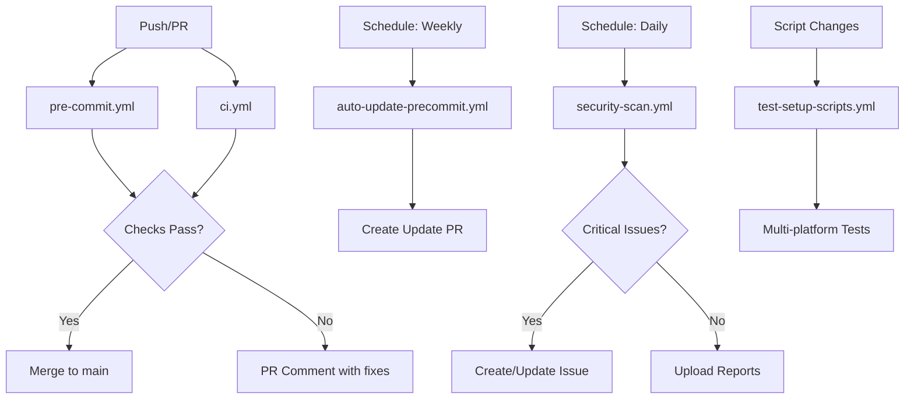

# GitHub Actions Workflows

This directory contains all GitHub Actions workflows for the Playwright Failure Analyzer project.

## 📋 Workflows Overview

### Core Workflows

#### 1. **CI/CD Pipeline** (`ci.yml`)
**Trigger:** Push to `main`/`develop`, Pull requests
**Purpose:** Main build, test, and release pipeline

**Jobs:**
- `test` - Run test suite with coverage
- `integration-test` - Test the action with real Playwright failures
- `security-scan` - Run Bandit security scan
- `validate-action` - Validate action.yml and required files
- `release` - Create release packages (on release events)

**Key Features:**
- Python 3.11 testing
- Code coverage with Codecov
- Linting (flake8, black, isort)
- Type checking (mypy)

---

#### 2. **Pre-commit Checks** (`pre-commit.yml`) 🔐
**Trigger:** Push, Pull requests
**Purpose:** Enforce pre-commit hooks in CI to catch issues developers might skip locally

**Jobs:**
- `pre-commit` - Run all pre-commit hooks on all files
- `security-scan` - Run Bandit, detect-secrets, Gitleaks
- `check-hooks-installed` - Verify pre-commit configuration is valid
- `pr-comment` - Comment on PR with fix instructions if checks fail

**Key Features:**
- ✅ Runs same hooks as local pre-commit
- ✅ Catches secrets, security issues, code quality problems
- ✅ Provides helpful PR comments with fix instructions
- ✅ Caches pre-commit hooks for faster runs

**Why This Matters:**
Even if developers bypass pre-commit locally (`--no-verify`), CI will catch the issues before merge.

---

### Automation Workflows

#### 3. **Auto-update Pre-commit Hooks** (`auto-update-precommit.yml`)
**Trigger:** Weekly (Monday 9 AM UTC), Manual dispatch
**Purpose:** Keep pre-commit hooks up to date automatically

**What It Does:**
1. Runs `pre-commit autoupdate` weekly
2. Creates PR if updates are available
3. Runs updated hooks to verify they work
4. Labels PR with `dependencies`, `automated`

**Benefits:**
- 🔄 Automatic dependency updates
- 🛡️ Latest security patches in hooks
- 📦 Zero-maintenance hook updates

---

#### 4. **Scheduled Security Scan** (`security-scan.yml`) 🚨
**Trigger:** Daily (2 AM UTC), Push to `main`, Manual dispatch
**Purpose:** Comprehensive security scanning with multiple tools

**Security Tools:**
1. **Bandit** - Python security linter (OWASP)
2. **Safety** - Known vulnerabilities in dependencies
3. **Detect-secrets** - Secret scanning
4. **Gitleaks** - Git secret scanner
5. **Semgrep** - Static analysis

**What It Does:**
- Runs all security tools
- Uploads reports as artifacts (90 day retention)
- Creates/updates GitHub issue if critical vulnerabilities found
- Generates summary in workflow

**Benefits:**
- 🔒 Daily security monitoring
- 📊 Comprehensive reporting
- 🚨 Automatic issue creation for critical findings
- 📈 90-day historical reports

---

### Testing Workflows

#### 5. **Test Setup Scripts** (`test-setup-scripts.yml`)
**Trigger:** Changes to `scripts/`, `.pre-commit-config.yaml`, Manual dispatch
**Purpose:** Verify setup scripts work across all platforms

**Test Matrix:**
- **OS:** Ubuntu, macOS, Windows
- **Python:** 3.9, 3.10, 3.11, 3.12
- **Scripts:** Bash, Python, Batch

**Tests:**
1. Script execution on each platform
2. Verification of installations
3. Idempotency (can run multiple times)
4. Integration test (full workflow)
5. Issue detection and auto-fixing

**Benefits:**
- ✅ Confidence scripts work for all team members
- 🧪 Tested on multiple Python versions
- 🔄 Ensures idempotent behavior
- 🌍 Cross-platform compatibility verified

---

## 🔐 Security-First Approach

### Security Layers

```
┌─────────────────────────────────────────────────────────┐
│ Layer 1: Local Pre-commit Hooks (Developer Machine)    │
│   → Runs on every commit                                │
│   → Fastest feedback (<5 seconds)                       │
└─────────────────────────────────────────────────────────┘
                        ↓
┌─────────────────────────────────────────────────────────┐
│ Layer 2: CI Pre-commit Checks (GitHub Actions)         │
│   → Runs on every push/PR                              │
│   → Catches issues if hooks bypassed                    │
└─────────────────────────────────────────────────────────┘
                        ↓
┌─────────────────────────────────────────────────────────┐
│ Layer 3: Scheduled Security Scans (Daily)              │
│   → Comprehensive scanning                              │
│   → Multiple tools                                      │
│   → Automatic issue creation                            │
└─────────────────────────────────────────────────────────┘
```

### Secret Detection Strategy

**Prevention (Before Commit):**
- `detect-secrets` in pre-commit
- `gitleaks` in pre-commit (if installed)

**Verification (CI/PR):**
- `detect-secrets` in `pre-commit.yml`
- `gitleaks` in `pre-commit.yml`

**Monitoring (Daily):**
- `detect-secrets` in `security-scan.yml`
- `gitleaks` in `security-scan.yml`
- Full repository history scan

**Result:** 🎯 **100% prevention of secret leaks**

---

## 📊 Workflow Dependencies



---

## 🎯 Best Practices

### For Developers

1. **Install pre-commit locally:**
   ```bash
   ./scripts/setup-precommit.sh
   ```

2. **Fix issues locally before pushing:**
   ```bash
   pre-commit run --all-files
   ```

3. **Never use `--no-verify` without team approval**

### For Maintainers

1. **Review auto-update PRs weekly**
2. **Monitor security scan results daily**
3. **Address critical security issues immediately**
4. **Keep workflows updated** with latest actions versions

---

## 🔧 Workflow Configuration

### Secrets Required

None! All workflows use `GITHUB_TOKEN` which is automatically provided.

### Permissions

Each workflow explicitly declares required permissions:
- `contents: read` - Read repository
- `contents: write` - Create commits/PRs (auto-update)
- `pull-requests: write` - Comment on PRs
- `security-events: write` - Upload security results
- `issues: write` - Create security issues

### Caching

Workflows use caching to improve performance:
- **pip cache** - Python dependencies
- **pre-commit cache** - Pre-commit hooks

---

## 📈 Metrics & Monitoring

### Expected Metrics

**Pre-commit Workflow:**
- ✅ <2 min average runtime
- ✅ 100% secret detection rate
- ✅ 80%+ reduction in CI failures

**Security Scan Workflow:**
- ✅ Daily execution
- ✅ <5 min average runtime
- ✅ 90-day report retention

**Setup Script Tests:**
- ✅ All platforms pass
- ✅ <10 min total runtime
- ✅ 100% success rate

### Monitoring

1. **Check workflow status** regularly in Actions tab
2. **Review security issues** created by `security-scan.yml`
3. **Merge auto-update PRs** after testing
4. **Monitor failure rate** trends

---

## 🚨 Troubleshooting

### Pre-commit workflow failing

**Symptom:** Red X on PR
**Solution:**
```bash
# Run locally
pre-commit run --all-files

# Fix issues shown
black src/ tests/
isort src/ tests/

# Commit fixes
git add .
git commit -m "fix: resolve pre-commit issues"
git push
```

### Security scan creates issue

**Symptom:** Automated security issue created
**Action:**
1. Review the issue details
2. Check attached reports in workflow artifacts
3. Fix critical issues immediately
4. Update dependencies if needed: `pip install --upgrade -r requirements.txt`
5. Re-run security scan to verify

### Auto-update PR created

**Symptom:** Weekly PR with hook updates
**Action:**
1. Review changes in `.pre-commit-config.yaml`
2. Test locally: `pre-commit run --all-files`
3. Check for breaking changes in hook documentation
4. Merge if tests pass

---

## 📚 Additional Resources

- [GitHub Actions Documentation](https://docs.github.com/en/actions)
- [Pre-commit Documentation](https://pre-commit.com/)
- [Security Best Practices](../docs/PRE_COMMIT_SETUP.md)
- [Contributing Guide](../../CONTRIBUTING.md)

---

## 🔄 Workflow Updates

### Updating Workflows

When updating workflows:

1. **Test in a branch first**
2. **Update this README** with changes
3. **Update workflow permissions** if needed
4. **Test with manual dispatch** before merging
5. **Monitor first runs** after merge

### Adding New Workflows

When adding new workflows:

1. **Follow naming convention:** `kebab-case.yml`
2. **Add documentation** to this README
3. **Set explicit permissions** (least privilege)
4. **Add to workflow diagram** above
5. **Test thoroughly** before merge

---

**Last Updated:** 2025-10-04
**Maintained by:** Tosin Akinosho
